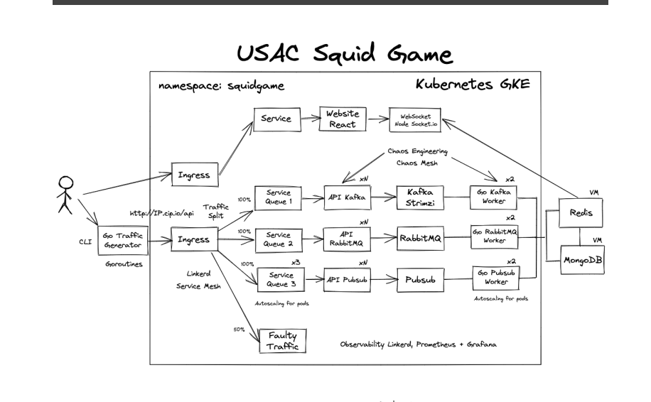
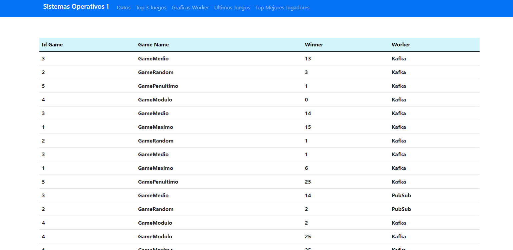
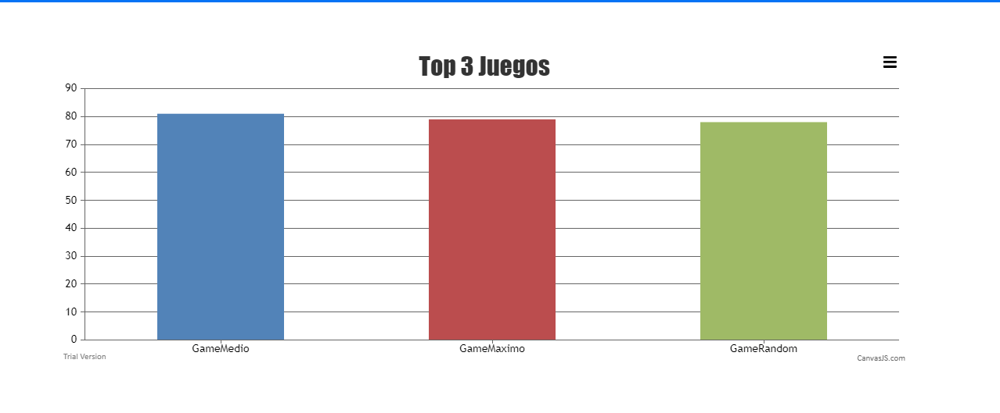
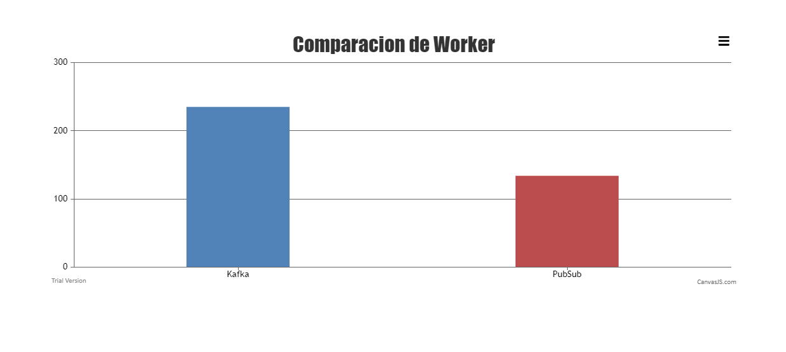

# Proyecto 2 - Sistemas Operativos 1


# Preguntas de analisis

**1. Cómo funcionan las métricas de oro, cómo puedes
interpretar las 7 pruebas de faulty traffic, usando como
base los gráficos y métricas que muestra el tablero de
Linkerd Grafana.**

* Las metricas de oro son una forma de observar y monitorear nuestros servicios. Con estas podemos ver el desempeño, la tasa de respuesta, el porcentaje de exito de peticiones que se realizan a nuestros servicios y otros. Cada metrica muestra en tiempo real la disponibilidad de nuestros servicios. 

* Las pruebas de faulty traffic nos permiten equilibrar la carga de nuestras aplicaciones, cuanto más trafico tenga nuestra aplicacion, más necesario es tener replicas de nuestro servicio para no sobrecargar 1 solo servidor.   
Básicamente, el dashboard de linkerd nos permite profundicar en la observabilidad de nuestras pruebas de trafico. 


**2. Menciona al menos 3 patrones de comportamiento que
hayas descubierto en las pruebas de faulty traffic**

* Las variaciones de las pruebas, mediante linkerd, generan graficos que evidencian la carga hacía uno u otro de los servicios de colas. 

* Aunque algunas pruebas especifican que el trafico debe ir más hacia un lado, el tiempo de respuesta puede ser igual en ambos servicios. Depende de la arquitectura y herramientas que usa cada cola. 

* El desempeño de cada cola esta más relacionado con su capacidad para procesar mas solicitudes al mismo tiempo, que por el porcentaje de trafico que se le envía. 

**3. ¿Qué sistema de mensajería es más rápido? ¿Por qué?**

*Desde las pruebas realizadas, consideramos que kafka era un sistema de mensajeria mas rapido, 
debido que a este fue posible poder crear varios consumidores para poder estar 
a la escucha. ademas que kafka es mucho mas escalable y confiable, el hecho de tener varios 
consumidores significa procesar datos una y otra vez*


**4. ¿Cuántos recursos utiliza cada sistema de mensajería?**

*Desde pubsub no es algo que se tenga controlado sobre los recursos, ya que es autoadministrada,
ahora hablando de lo que es kafka los recursos utilizados dependera que tanto se quiere realizar con este servicio, considerado lo que nosotros realizamos pues una maquina con 8 gb de ram es bien manejado*

**5. ¿Cuáles son las ventajas y desventajas de cada servicio de
mensajería?**

#### PubSub

**Pros**
- Facil acceso y con permisos de IAM, la seguridad es muy buena
- Baja latencia, alto rendimiento
- Ancho de banda Ilimitados

**Contras**
- No puede extender la cola a mas alla de 7 dias
- Lo consideramos un poco complicado reproducir mensajes no reconocidos

#### Kafka
**Pros**
- El modelo Pub/ Sub
- Transferencia de datos rapida, independientemente del volumen (si se tiene recursos)
- Capacidad de transferir grandes cantidad de datos de forma coherente.

**Contras**
- Requiere algo de tiempo de instalacion e implementacion inicial
- No es una solucion del todo completa
- No tiene un motor de consultas.


**6. ¿Cuál es el mejor sistema de mensajería?**

*Desde lo que nosotros consideramos, teniendo en cuenta tiempo y dinero, nos quedarias con el sistema de pubSub de Google, al ser un sistema autoadministrado ahorra tiempo en estar realizando configuraciones y midiendo la cantidad de recursos utilizados. Tome en cuenta que la opinion es realizada desde el sistema que se realizo,
puede que en un sistema complejo, kafka o rabbit sean mejor opcion.*

**7. ¿Cuál de las dos bases de datos se desempeña mejor y por
qué?**

*En lo que nosotros realizamos consideramos que mongodb posee un gran potencial, esta base ha ido mejorando mas con el tiempo y la capacidad que posee en poder manejar objetos json la convierte una buena opcion a ser utilizada en lo que es aplicaciones web en tiempo real, la capacidad de respuesta de esta base era superior en cuanto a redis, al poder generar consultas, conteos y tops*

**8. ¿Cómo se reflejan en los dashboards de Linkerd los
experimentos de Chaos Mesh?**

* Facilmente se puede observar las interrupciones que se generan en las solicitudes, la disminución del volumen de solicitudes y las respuestas. 
Las graficas y valores que linkerd muestra, son fáciles de analizar y lo suficientemente precisos para observar los problemas que pueden generar, arquitecturas mal estructuradas y servicios que puedan saturarse y colapsar. 

**9. ¿En qué se diferencia cada uno de los experimentos
realizados?**

* Las pruebas se diferencian por el tiempo que un servicio esta inactivo, por la latencia que le injecta una u otra prueba. 
Los servicios se recuperaban más rapido en algunas pruebas que en otras. 

Asi mismo, la indisponibilidad de los servicios depende de que tan frecuente se ejecute la prueba. Si solo se realiza una vez, no surte mucho daño, sin embargo, si la prueba se injecta recurentemente y por un largo periodo, el daño es mayor por el tiempo total que el servicio no funciona. 

**10. ¿Cuál de todos los experimentos es el más dañino?**

- Pod kill es un experimento bastante dañino, ya que este detiene por completo un pod y para volver a estabilizarse, se debe reiniciar por completo el pod. 
A diferencia de PodFailure que solo desabilita el pod por un X tiempo, pero no ocasiona un reinicio de este. 

# Manual Tecnico

## Arquitectura


## Modelo de datos

Para el manejo de los datos se utilizo una base de datos no SQL, dada la cantidad de informacion
que se generaba.
```javascript
    request_number: Number,
    game: Number,
    gamename: String,
    winner: String,
    worker: String
```

## Descripcion de Herramientas

### Kafka
Apache Kafka es una plataforma distribuida de transmisión de datos que permite publicar, almacenar y procesar flujos de registros, así como suscribirse a ellos, de forma inmediata. Está diseñada para administrar los flujos de datos de varias fuentes y distribuirlos a diversos usuarios

### PubSub
Pub/Sub, que significa publicador/suscriptor, permite que los servicios se comuniquen de forma asíncrona, con latencias de alrededor de 100 milisegundos.

### MongoDB
MongoDB es una base de datos de documentos que ofrece una gran escalabilidad y flexibilidad, y un modelo de consultas e indexación avanzado.

### Redis
Redis, que significa Remote Dictionary Server, es un rápido almacén de datos clave-valor en memoria de código abierto. El proyecto se inició cuando Salvatore Sanfilippo, el desarrollador original de Redis, trataba de mejorar la escalabilidad de su empresa emergente italiana. A partir de ahí, desarrolló Redis, que ahora se utiliza como base de datos, caché, agente de mensajes y cola.

### Kubernetes
Kubernetes es una plataforma portable y extensible de código abierto para administrar cargas de trabajo y servicios. Kubernetes facilita la automatización y la configuración declarativa. Tiene un ecosistema grande y en rápido crecimiento. El soporte, las herramientas y los servicios para Kubernetes están ampliamente disponibles.

### NodeJS
Node.js es un entorno controlado por eventos diseñado para crear aplicaciones escalables, permitiéndote establecer y gestionar múltiples conexiones al mismo tiempo. Gracias a esta característica, no tienes que preocuparte con el bloqueo de procesos, pues no hay bloqueos.

### GO
 El lenguaje se diferencia de los demás por ser compilado y altamente escalable. Sus creadores lo definen como “simplista”; teniendo en cuenta que facilita la creación de softwares simples, confiables y eficientes

# Manual usuario

La interfaz de la aplicacion web, es intituiva y facil de utilizar contando con las siguientes 
partes

- Datos: Muestra todos los datos almacenados
- Top 3 Juegos: Muestra los juegos mas solicitados
- Graficas Worker: Muestra la cantidad de solicitudes realizadas a cada cola
- Ultimos Juegos: Muestra los ultimos 10 juegos generados
- Top Mejores jugadores: Muestra quienes son los mejores jugadores







